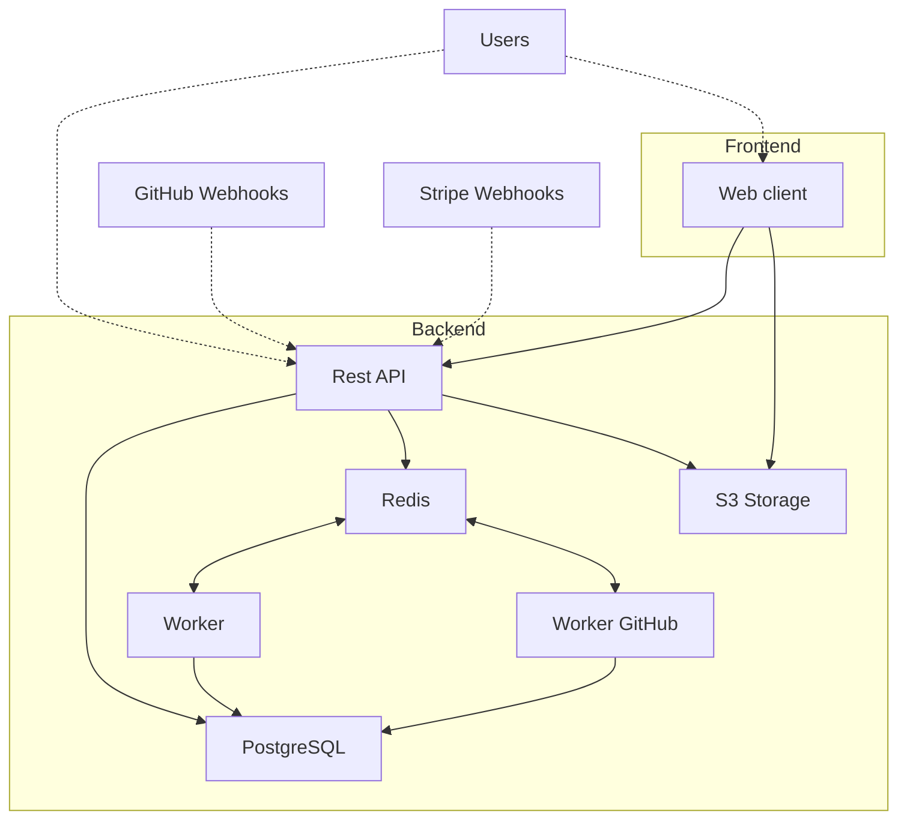

<p align="center">
  <a href="https://polar.sh">
      
  </a>
</p>

<div align="center">
<a href="https://www.producthunt.com/posts/polar-5?embed=true&utm_source=badge-top-post-badge&utm_medium=badge&utm_souce=badge-polar&#0045;5" target="_blank"></a>  <a href="https://www.producthunt.com/posts/polar-5?embed=true&utm_source=badge-top-post-topic-badge&utm_medium=badge&utm_souce=badge-polar&#0045;5" target="_blank"></a>
</div>

<hr />
<div align="center">

<a href="https://polar.sh">Website</a>
<span>&nbsp;&nbsp;•&nbsp;&nbsp;</span>
<a href="https://polar.sh/polarsource">Blog</a>
<span>&nbsp;&nbsp;•&nbsp;&nbsp;</span>
<a href="https://polar.sh/docs">Docs</a>
<span>&nbsp;&nbsp;•&nbsp;&nbsp;</span>
<a href="https://docs.polar.sh/api-reference">API Reference</a>

<p align="center">
  <a href="https://discord.gg/Pnhfz3UThd">
    
  </a>

  <a href="https://twitter.com/intent/follow?screen_name=polar_sh">
    
  </a>
</p>
</div>
<hr />

# Polar: Open Source Monetization Platform for Developers

Polar is an all-in-one open source monetization platform designed specifically for developers. Focus on building your passion, while we focus on the infrastructure to get you paid.

## 🚀 Key Features

- **Digital Products & Subscriptions**: Sell access to GitHub repositories, Discord support channels, file downloads, license keys, and more
- **GitHub Issue Funding**: Set up crowdfunding on your GitHub issues
- **Merchant of Record**: We handle all the complexities of:
  - Billing, receipts, and customer accounts
  - Sales tax and VAT compliance
  - Payment processing

## 💰 Pricing

- 4% + 40¢ per transaction
- No fixed monthly costs
- Additional fees may apply. [Read more](https://docs.polar.sh/documentation/polar-as-merchant-of-record/fees)

## 🏗️ Architecture

Polar's stack consists of the following components:



### Technology Stack

#### Backend
- **Language**: Python 3.12
- **Framework**: FastAPI
- **Database**: PostgreSQL
- **Cache**: Redis
- **Storage**: S3-compatible storage
- **Task Queue**: Arq
- **ORM**: SQLAlchemy

#### Frontend
- **Framework**: Next.js (TypeScript)
- **Package Manager**: pnpm
- **Build System**: Turborepo
- **UI Development**: Storybook

## 🧩 Repository Structure

Polar is organized as a monorepo with the following main components:

### Server
The backend API and workers written in Python:
```
server/
├── polar/            # Core application code
├── migrations/       # Database migrations
├── tests/            # Test suite
└── polar_backoffice/ # Admin interface
```

### Clients
The frontend applications and packages:
```
clients/
├── apps/
│   └── web/          # Main web application (Next.js)
└── packages/
    ├── ui/           # Shared UI components
    ├── client/       # API client
    ├── checkout/     # Checkout components
    └── polarkit/     # Shared React components
```

## 🛠️ Development

### Prerequisites

- Python 3.12
- Node.js 22
- Docker (for local development)
- pnpm (for frontend development)
- uv (for Python dependency management)

### Quick Start

The fastest way to get started is using GitHub Codespaces:

[](https://codespaces.new/polarsource/polar?machine=standardLinux32gb)

### Local Setup

1. **Setup environment variables**:
   ```sh
   ./dev/setup-environment
   ```

2. **Start development containers**:
   ```sh
   cd server
   docker compose up -d
   ```

3. **Install backend dependencies**:
   ```sh
   uv sync
   ```

4. **Install frontend dependencies**:
   ```sh
   cd clients
   pnpm install
   ```

5. **Apply database migrations**:
   ```sh
   cd server
   uv run task db_migrate
   ```

6. **Start the backend**:
   ```sh
   uv run task api
   uv run task worker
   ```

7. **Start the frontend**:
   ```sh
   cd clients
   pnpm run dev
   ```

For more detailed setup instructions, see our [`DEVELOPMENT.md`](./DEVELOPMENT.md) file.

## 🔌 API & SDK

You can integrate Polar into your own applications using our:

- [Public API](https://docs.polar.sh/api-reference)
- [Webhook API](https://docs.polar.sh/developers/webhooks)

We maintain official SDKs for:
- JavaScript/TypeScript: [polarsource/polar-js](https://github.com/polarsource/polar-js)
- Python: [polarsource/polar-python](https://github.com/polarsource/polar-python)

## 🗺️ Roadmap & Community

- **🎯 Upcoming milestones**: [Check out what we're building towards](https://github.com/polarsource/polar/issues/3242)
- **💬 Shape the future of Polar**: [Join our Discord](https://discord.gg/Pnhfz3UThd)
- **🐛 Found a bug?** [Submit it here](https://github.com/polarsource/polar/issues)
- **🔓 Security vulnerabilities**: We appreciate responsible and private disclosures. See [Security](./SECURITY.md)

## 👥 Contributors

<a href="https://github.com/polarsource/polar/graphs/contributors">
  
</a>

## 📜 License

Licensed under [Apache License, Version 2.0](https://www.apache.org/licenses/LICENSE-2.0).

## 🙏 Acknowledgements

<sub>♥️ To our `pyproject.toml` friends: [FastAPI](https://github.com/tiangolo/fastapi), [Pydantic](https://github.com/pydantic/pydantic), [Arq](https://github.com/samuelcolvin/arq), [SQLAlchemy](https://github.com/sqlalchemy/sqlalchemy), [Githubkit](https://github.com/yanyongyu/githubkit), [sse-starlette](https://github.com/sysid/sse-starlette), [Uvicorn](https://github.com/encode/uvicorn), [httpx-oauth](https://github.com/frankie567/httpx-oauth), [jinja](https://github.com/pallets/jinja), [blinker](https://github.com/pallets-eco/blinker), [pyjwt](https://github.com/jpadilla/pyjwt), [Sentry](https://github.com/getsentry/sentry) + more</sub><br />
<sub>♥️ To our `package.json` friends: [Next.js](https://github.com/vercel/next.js/), [TanStack Query](https://github.com/TanStack/query), [tailwindcss](https://github.com/tailwindlabs/tailwindcss), [zustand](https://github.com/pmndrs/zustand), [openapi-typescript-codegen](https://github.com/ferdikoomen/openapi-typescript-codegen), [axios](https://github.com/axios/axios), [radix-ui](https://github.com/radix-ui/primitives), [cmdk](https://github.com/pacocoursey/cmdk), [framer-motion](https://github.com/framer/motion) + more</sub><br />
<sub>♥️ To [IPinfo](https://ipinfo.io) that provides IP address data to help us geolocate customers during checkout.</sub>